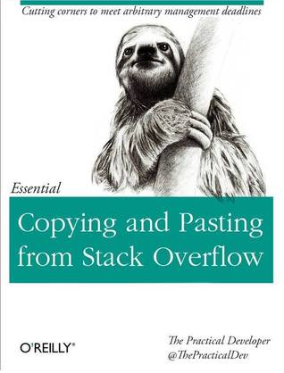

name: heading
layout: true
class: center, middle, inverse

---

# Good Code

Chris Dail - [@chrisdail](https://twitter.com/chrisdail)

Senior Director, Software Engineering at [Akiri](https://akiri.com)

---

template: heading


---

template: heading

# Why is good code important?

---

layout: false

# Bad Code

- Bad code decreases productivity over time
- Makes it hard to maintain
- Broken Window Affect
  - Bad code causes carelessness
  - leads to more bad code

---

template: heading
# Good Code Makes Happy Coders

---

# Qualities of Good Code

- **Readability**
  - Other people need to maintain it
  - Developer spend more time reading than writing code
- Simple - So it can be understood easily
- Minimal - No duplication
- One thing - Functions do one thing only
- No surprises - Should work as expected
- Meaningful Naming - Self documenting.
- Small, simple abstractions

---

template: heading

# Clean it up in the next release
# We have deadlines to hit
## Dangerous Thinking

---

# Get it Right the First Time

- You will likely never come back to fix things
- There is always a 'Grand Redesign' on the horizon that will never come
- Code Reviews: Don't let poor code slip through

---

# Quantity and Quality

- Industry average is around 15-50 bugs per 1000 lines of code
- Writing less code will result in fewer bugs
- Cannot do this artificially
  - Remember **Readability**
  - Go for fewer lines that are more meaningful (quality)
  - Keep things simple

---

class: bad

# Naming

- Reveal Intent - what is this thing used for?
```
AccountPrincipal p;
```
- Meaningful distinctions, avoid "noise words" redundant
```
RestClient clientToUse = getClient();
```
- Human readable / searchable - No per character cost
```
String acctNm
```
- Follow standards: like javabean naming in Java.

---

# Naming

- Classes/Types: Nouns, meaningful and avoid fluff words
.good[
```
Account
Alert
DailyUsage
AuthorizationPolicy
```
]
.bad[
```
SystemData
ConfigInfo
Manager
Util
```
]

---

# Naming

- Methods/Functions: Verbs. Function names descriptive and don't be afraid of length
.good[
```
process()
startMonitor()
modifyAccount()
runPlaybookAndWaitComplete()
```
]
.bad[
```
varsWithTarget()
taskStatusInProgress()
```
]

---

class: bad

# Naming - Avoid Encodings

- Type, Scope, Static information encoded in the name
- Scope information encoded in the name
- Avoid Hungarian Notation
- This is what we have IDEs and syntax highlighting for

```
ListBox lb_name
private static Logger _log;
private m_name;
Integer nSize;
List<User> usersList;
```

---

# Naming - Libraries / Modules / Packages

- Top 5 worst modules names
  - `utils`
  - `commons`
  - `shared`
  - `lib`
  - `tools`
- No information about their usage
- Alternatives
  - `io`
  - `config`
  - `encryption`

---

class: bad

# Functions

- Should do **one** thing and only one thing
```
private void validateAndExtractInformationFromZip()
```
- Be wary of **and** in function names
- You can always call another function
- Should be short (Keep under 20 lines in most cases)
- Avoid side effects (getName should not change state)

---

class: bad

# Classes and Objects

- Classes should also **Do One Thing**
- Single Level of Abstraction
- Properties and functions follow the "theme" of the class
- Avoid "junk Drawer" classes the mix unrelated things

---

class: bad

# Magic Numbers

- Avoid magic numbers or magic strings
- Use constants defined in one place

```
if ((i == 0) &&
!((attVal.charAt(i) >= 1 && attVal.charAt(i) <= 31)
|| (attVal.charAt(i) == 33)
|| (attVal.charAt(i) >= 36 && attVal.charAt(i) <= 42)
|| (attVal.charAt(i) >= 45 && attVal.charAt(i) <= 58)
|| (attVal.charAt(i) == 61)
|| (attVal.charAt(i) >= 63 && attVal.charAt(i) <= 91)
|| (attVal.charAt(i) >= 93)
```

---

# Comments

- Add comments only when it enhances the readability of the code
- If you need to explain your code, maybe the code is not clear
- Explain **intent** of the code
- Answer **Why** not **How**
- Use TODOs sparingly
  - Things to be implemented soon (by you)
  - Works in progress
  - Unimplemented features belong in Trello/JIRA

---

class: bad

# Avoid Comments That Are

- Redundant - Is it saying the same thing as the code?
```
// Checks for null
if (state == null) {
    return null; // XXX
}
```
```java
  /**
    * Construct an account chargeback context.
    *
    * @param   name    The account name
    * @param   id      The account ID
    */
  public AccountChargeback(String name, String id) {
      super(name, id);
  }
```

---

class: bad

# Avoid Comments That Are

- Misleading
```
// Check to see if the order is valid.
// Returns true for valid, false for invalid
public boolean validateOrder(Order order) {
    if (!order.isValid()) {
        throw new ValidationException("Order is not valid");
    }
    return true;
}
```
- Commented Out Code - This is what version control history is for
- References to bug numbers - Also, version control history
```
// fix for CP-1234
if (state == null) {
```

---

# Formatting

- Keep files short (Typically less than 300 lines)
- Keep line length short (<120 characters)
- Maximum of 2 levels of indenting in a function in most cases
- Use whitespace to separate 'paragraphs' of code
- Variables declared close to usage as possible, instance variables at the top of the class

---

template: heading

# Scout Rule
## Leave the code better than you found it

---

template: heading


---

# When in Rome

- Follow the conventions of the language and codebase you are in
- CamelCase vs snake_case
- Tabs vs Spaces (Java 4 spaces, Go-lang tabs)
  - Consistent indentation levels
- If you need to reformat code, do so in a standalone commit

---

# Error Handling

- Early return for invalid cases (bouncer pattern?)
- Behave in reasonable ways over throwing errors (empty list, might as well error)
- No exception swallowing

---

# DRY - Don't Repeat Yourself

- "Every piece of knowledge must have a single unambiguous, authoritative representation within a system" - Pragmatic Programmer
- redundant comments are an example of repetition
- Multiple developers - Duplication of validation/util functions. Central place for these. Look before your write
- Make reuse easy

---

template: heading


---

# Copy and Paste

- Copy-Paste may be the most evil programming technique
- Single change needs to be fixed in multiple places
- You may not fully understand the code being copied
- Consider reuse with functions over copy and paste

---

# Version Control

- Readability of Version Control History should read like a story
- commit comments
- small commits
- small pull requests

---

# Clever Code

- Be wary of "clever" or "cute" code
- Solutions that are not intuitive may be harder to read
- Sometimes the more dull, straightforward way is better
- Keep in mind the programming level of your team

---

# Reinventing the Wheel

- Consider open source packages over rolling your own
- All code is a liability you need to maintain
- Ask if this library is part of your code competencies
- Get over your pride
  - You may be able to build a great search engine
  - Your time may be better used elsewhere

---

# Using Third Party / Open Source Packages

- As few dependencies as required to do the task
- Favor using tools you already have
- Choose the right tool for the job
  - How much code do I need to use this?
  - bash/sed/awk are poor json parsers
- Fork wisely. Fork only if needed and do it right
  - Avoid cherry-picking and committing modified files

---

# Reading List

- Clean Code - Robert C. Martin
- The Pragmatic Programmer - Andrew Hunt, David Thomas
- Code Complete - Steve McConnell

---


